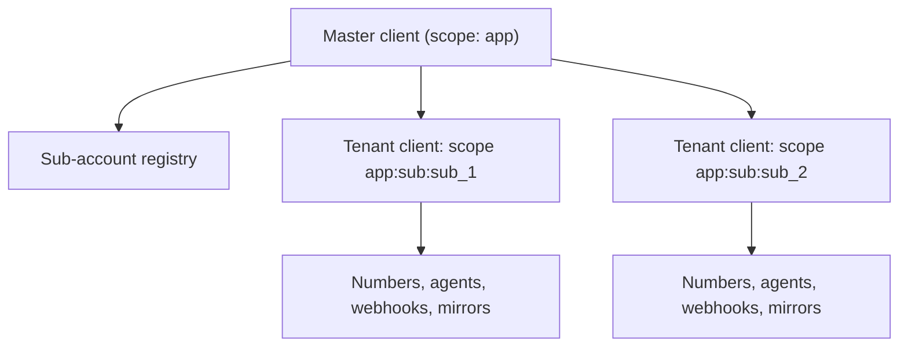

A SaaS that gives each customer their own phone presence needs two boundaries to line up:

- **At AgentPhone**, a *sub-account* isolates agents, numbers, conversations, calls, webhooks, and 10DLC registration under one master account and one API key.
- **In Convex**, a *scope* isolates everything the component stores: mirrors, event history, webhook secrets, delivery IDs, and queue idempotency keys.

`forSubAccount` ties them together, so one master client in `convex/agentphone.ts` yields a fully isolated client per tenant.



## 1. Create the master client

```ts convex/agentphone.ts
import { AgentPhone } from "agentphone-convex";
import { components, internal } from "./_generated/api.js";

export const agentphone = new AgentPhone(components.agentphone, {
  scope: "app",
});
agentphone.incomingEventCallback = internal.agentphone.handleEvent;
```

One API key, set once with `npx convex env set AGENTPHONE_API_KEY=...`, serves the master account and every sub-account: billing and credentials are shared, everything else is isolated.

## 2. Register one webhook route

```ts convex/http.ts
import { httpRouter } from "convex/server";
import { agentphone } from "./agentphone.js";

const http = httpRouter();
agentphone.registerRoutes(http);
export default http;
```

Register routes on the master client only. Every tenant webhook points at the same path with its own `?scope=` parameter, and the component verifies each delivery against the secret stored for that scope.

## 3. Provision a tenant

Pass your tenant ID as `key`. The component claims that key in a transaction before it calls AgentPhone, so a double-clicked signup or a retried action can never leave a tenant with two sub-accounts.

```ts convex/tenants.ts
export const provisionTenant = internalAction({
  args: { tenantId: v.id("tenants"), name: v.string() },
  returns: v.null(),
  handler: async (ctx, args) => {
    const subAccount = await agentphone.createSubAccount(ctx, {
      name: args.name,
      key: args.tenantId,
    });

    const tenant = agentphone.forSubAccount(subAccount);
    await tenant.configureWebhook(ctx, { contextLimit: 10 });
    const number = await tenant.provisionNumber(ctx, { country: "US" });
    const agent = await tenant.createAgent(ctx, {
      name: `${args.name} assistant`,
      voiceMode: "webhook",
    });
    await tenant.attachNumberToAgent(ctx, {
      agentId: agent.id,
      numberId: number.id,
    });

    await ctx.runMutation(internal.tenants.setAgentPhone, {
      tenantId: args.tenantId,
      subAccountId: subAccount.subAccountId,
      numberId: number.id,
      agentId: agent.id,
    });
    return null;
  },
});
```

Storing `subAccountId` on your own tenant row is worthwhile even though the registry already holds it: it keeps tenant reads in your own indexes. The registry remains the source of truth for provisioning.

## 4. Operate as a tenant

Everything the client can do works the same way on a derived client, against that tenant's sub-account and scope.

```ts
function tenantClient(tenant: Doc<"tenants">) {
  return agentphone.forSubAccount(tenant.subAccountId, {
    defaultAgentId: tenant.agentId,
    defaultNumberId: tenant.numberId,
  });
}

await tenantClient(tenant).sendMessage(ctx, {
  toNumber: customer.phone,
  body: "Your appointment is tomorrow at 10:00 AM.",
});
```

<Note>
  Agent and number defaults are not inherited from the master client, because a
  sub-account cannot see resources in the master account. Pass each tenant's own
  defaults, as above.
</Note>

## 5. Route inbound events to the right tenant

Callbacks receive the scope the delivery arrived on. Turn it back into a tenant with `subAccountScope`, or read the sub-account ID out of the scope.

```ts convex/agentphone.ts
export const handleEvent = internalMutation({
  args: eventCallbackArgs,
  returns: v.union(voiceResponseValidator, v.null()),
  handler: async (ctx, { event, scope }) => {
    const tenant = await ctx.db
      .query("tenants")
      .withIndex("by_scope", (q) => q.eq("agentPhoneScope", scope))
      .unique();
    if (!tenant) {
      throw new Error(`No tenant owns AgentPhone scope ${scope}`);
    }
    await ctx.db.insert("inbox", { tenantId: tenant._id, event });
    return null;
  },
});
```

Store `agentphone.subAccountScope(subAccountId)` on the tenant row when you provision it, and this lookup stays a single indexed read.

## 6. Authorize tenant reads

Scopes isolate data; they do not authorize users. Every public function that returns AgentPhone data must check that the caller belongs to the tenant whose scope it reads.

```ts
export const conversations = query({
  args: { tenantId: v.id("tenants") },
  returns: v.array(conversationValidator),
  handler: async (ctx, args) => {
    const tenant = await requireTenantMember(ctx, args.tenantId);
    return await agentphone
      .forSubAccount(tenant.subAccountId)
      .listLocalConversations(ctx, { limit: 50 });
  },
});
```

See [Authorization](/guides/authorization) for the JWT-claim helper and when to replace it with a membership lookup.

## Reconciliation and limits

<AccordionGroup>
  <Accordion title="Adopting tenants that predate the component">
    Run `syncSubAccounts` to pull AgentPhone's list into the registry, then
    `adoptSubAccount({ subAccountId, key })` to bind each one to a tenant ID.
    From then on `createSubAccount` with that key is a no-op.
  </Accordion>
  <Accordion title="A provisioning attempt that never settled">
    If AgentPhone timed out or returned a `5xx`, the claim is marked
    `unresolved` and later attempts throw rather than risk a duplicate. Run
    `syncSubAccounts`, then either `adoptSubAccount` (AgentPhone did create it)
    or `releaseSubAccountClaim` (it did not). Claims are leased for five
    minutes, so a release cannot cut in front of a create that is still within
    its lease. After the lease lapses, the first release demotes the claim to
    `unresolved` instead of deleting it, so a late AgentPhone response can still
    finish. Freeing that lease-demoted claim requires
    `releaseSubAccountClaim({ key, force: true })` only after you confirm the
    create is gone.
  </Accordion>
  <Accordion title="Offboarding a tenant">
    `deleteSubAccount` deletes the sub-account at AgentPhone and drops its
    registry entry. Records already mirrored under the tenant scope stay until
    you delete them, which keeps history available for exports and audits.
  </Accordion>
  <Accordion title="Platform limits">
    AgentPhone allows up to 500 sub-accounts per master account and a single
    level of nesting: a sub-account cannot create sub-accounts. The client
    enforces the nesting rule locally — sub-account management on a derived
    client throws instead of failing at the API.
  </Accordion>
</AccordionGroup>
